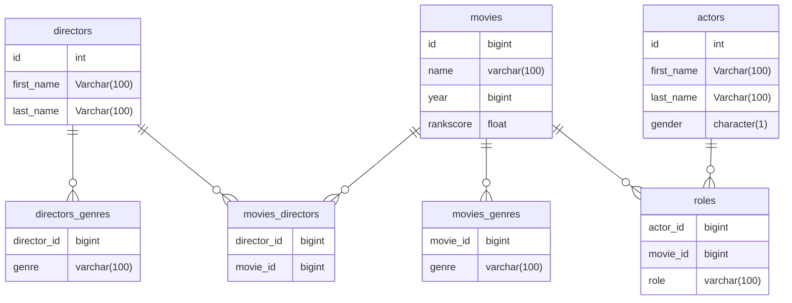

# ERD for table relation of MOVIES DATABASE

```mermaid
    erDiagram
        actors{
            id int
            first_name Varchar(100)
            last_name Varchar(100)
            gender character(1)
        }
        directors{
            id int
            first_name Varchar(100)
            last_name Varchar(100)
        }
        directors_genres{
            director_id bigint
            genre varchar(100)
        }

        movies{
            id bigint
            name varchar(100)
            year bigint
            rankscore float
        }
        movies_directors{
            director_id bigint
            movie_id bigint
        }

        movies_genres{
            movie_id bigint
            genre varchar(100)
        }
        roles{
            actor_id bigint
            movie_id bigint
            role varchar(100)
        }

        directors ||--o{ directors_genres : ""
        movies ||--o{ movies_directors : ""
        directors ||--o{ movies_directors : ""
        movies ||--o{ movies_genres : ""
        actors ||--o{ roles : ""
        movies ||--o{ roles : ""
```